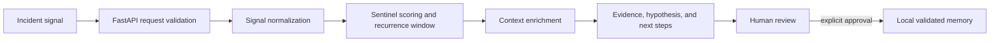

# RAVEN

RAVEN is a functional incident-analysis and operational memory engine built with Python and FastAPI.

It organizes scattered incident information, separates evidence from hypotheses, and helps clarify where an investigation should begin.

RAVEN is a selected technical project and part of the foundation behind the broader FOXHUMAN approach to human-centered operational systems.

## Status

RAVEN is under active development. Its analysis pipeline, API, structured investigation output, and human-approved resolution memory are functional and covered by automated tests. The project has been used to support real investigation scenarios, while the public repository contains only synthetic examples and no third-party operational data.

RAVEN is not presented as a finished commercial platform or as a replacement for observability tools.

## What RAVEN does

- Normalizes individual incident signals.
- Applies deterministic, rule-based risk scoring.
- Groups recurring signal patterns under stable incident identifiers.
- Returns evidence separately from an investigation hypothesis.
- Suggests investigation steps while keeping the final decision with a human.
- Records analyst-approved resolution context in local JSONL storage.
- Exposes health, status, analysis, evaluation, and controlled feedback endpoints.

## Architecture



The API layer handles HTTP validation, authentication, and response models. The Sentinel package contains normalization, scoring, recurrence detection, and action dispatch. Approved resolution records are stored locally as JSONL files. See [docs/architecture.md](docs/architecture.md).

## Getting started

Requirements:

- Python 3.11 or newer

Clone the repository, then run:

```bash
python -m venv .venv
```

Activate the environment:

```bash
# macOS or Linux
source .venv/bin/activate

# Windows PowerShell
.\.venv\Scripts\Activate.ps1
```

Install the project and test dependency:

```bash
python -m pip install --upgrade pip
python -m pip install -e ".[dev]"
```

Create the local configuration:

```bash
# macOS or Linux
cp .env.example .env

# Windows PowerShell
Copy-Item .env.example .env
```

Replace the placeholder `RAVEN_API_KEY` in `.env`, then export the variables before starting the process. This project does not automatically load `.env` files.

```bash
# macOS or Linux example
export RAVEN_API_KEY="choose-a-local-development-key"

# Windows PowerShell example
$env:RAVEN_API_KEY="choose-a-local-development-key"
```

Start the API:

```bash
python -m uvicorn raven.api.main:app --host 127.0.0.1 --port 8000
```

Open:

- API documentation: <http://127.0.0.1:8000/docs>
- Health check: <http://127.0.0.1:8000/health>

Run the tests:

```bash
python -m pytest tests -q
```

## Synthetic example

```bash
curl -X POST "http://127.0.0.1:8000/v1/analyze" \
  -H "Content-Type: application/json" \
  -H "X-API-Key: choose-a-local-development-key" \
  -d '{
    "message": "Checkout API returned HTTP 503 after a configuration change in the synthetic staging environment",
    "source": "application"
  }'
```

The response includes a risk score, evidence, an investigation hypothesis, context, and suggested next steps. A complete synthetic workflow is available in [examples/synthetic-investigation.http](examples/synthetic-investigation.http).

Additional synthetic log samples cover a clear incident, normal operation, and an ambiguous signal in [examples/logs](examples/logs/README.md).

## Project structure

```text
src/raven/api/        FastAPI application, authentication, and HTTP routes
src/raven/sentinel/   Normalization, scoring, recurrence, and action pipeline
tests/                Automated tests
docs/                 Public architecture and API notes
examples/             Synthetic request examples
```

## Security and privacy

All committed examples are synthetic. Never commit `.env`, API keys, incident logs, local JSONL storage, or information copied from a real investigation. See [SECURITY.md](SECURITY.md).

## Limitations

- Scoring and enrichment are deterministic heuristics, not learned models.
- The recurrence window and rate limits are in-memory and process-local.
- Validated memory uses local JSONL files rather than a transactional database.
- No durability, horizontal-scaling, or high-availability guarantees are provided.
- Suggested hypotheses and next steps require human verification.
- External observability data must be supplied to the API by the user; this public edition does not ship a vendor-specific connector.
- Security controls are suitable for local experimentation, not a claim of production hardening.

## Background

RAVEN was created to transform incident data into clearer operational context. The project helped shape the broader FOXHUMAN approach to human-centered operational systems.

## Third-party notice

This independent project is not affiliated with, endorsed by, or an official project of any third-party observability provider.

## Author

Michelle Braz  
Founder at FOXHUMAN

## License

MIT
