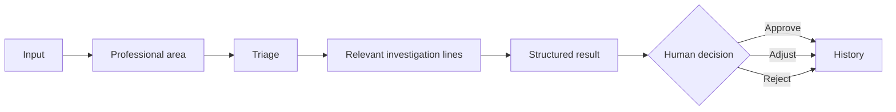
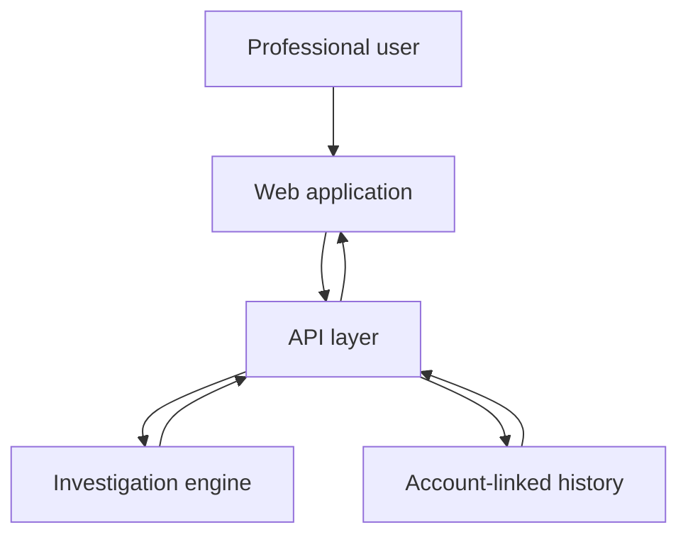
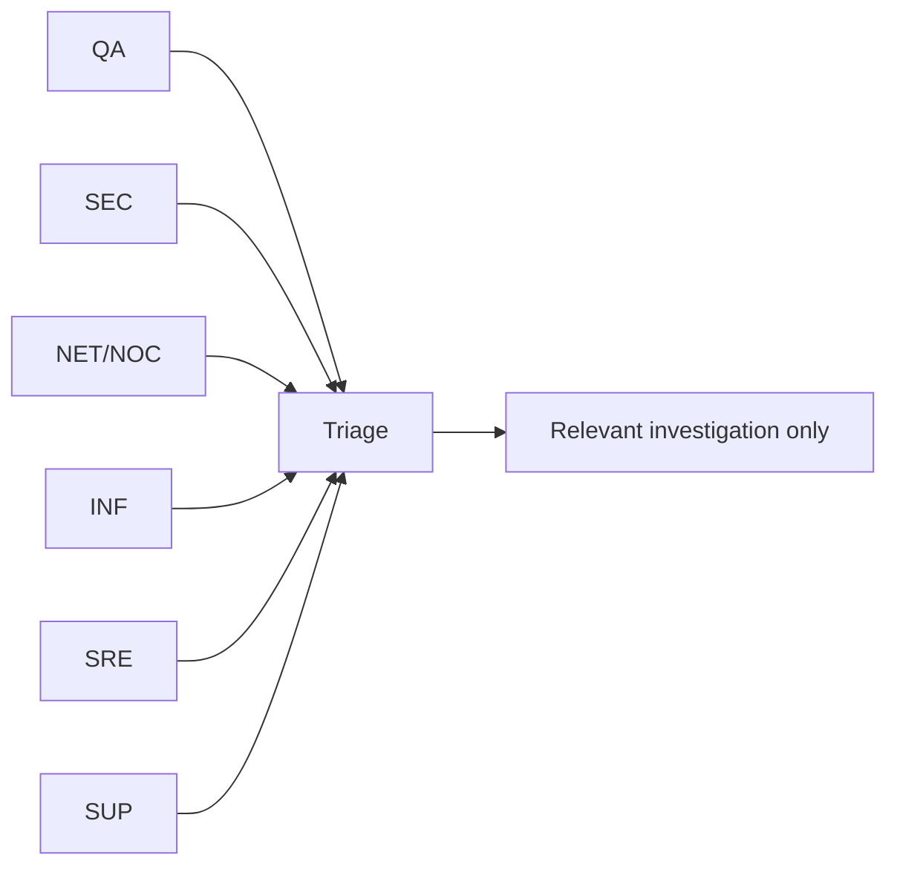
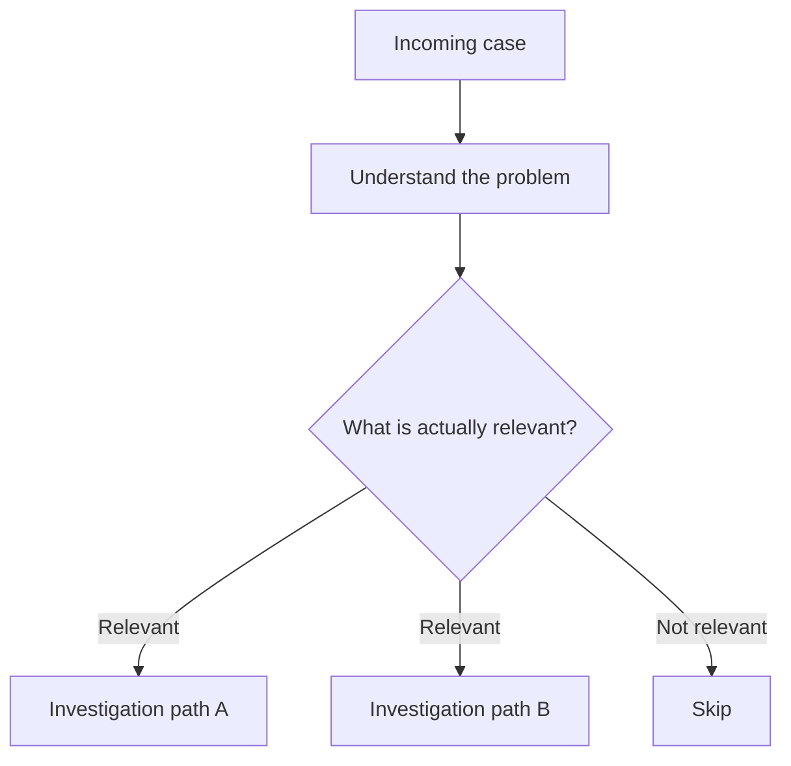
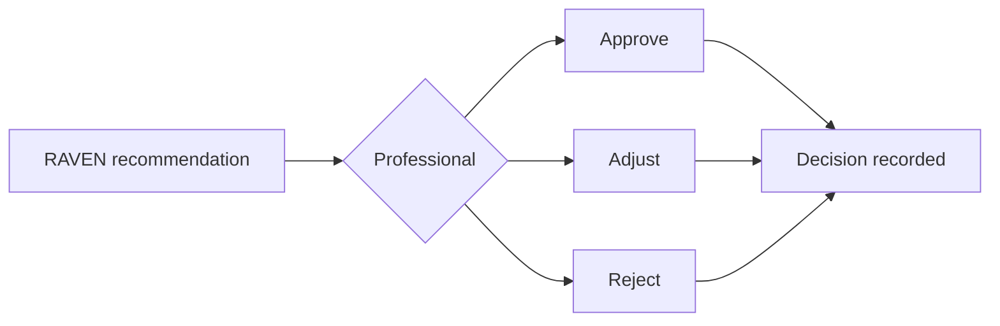

# RAVEN — Visual Technical Overview

> A public, high-level technical map of RAVEN.  
> Proprietary heuristics, weights, private rules and internal engine implementation are intentionally not exposed.

---

## 🧭 System purpose

RAVEN is a human-centered decision-support layer for professional technical investigation.

Its job is to transform an incoming case into a structured result while preserving the professional as the final decision-maker.

---

## 🏗️ Architecture at a glance

### Main layers

| Layer | Responsibility |
|---|---|
| 🖥️ **Web application** | captures the case, context and human decision |
| 🔌 **API** | connects the interface, engine and persisted state |
| 🧠 **Investigation engine** | performs triage and selects relevant investigation paths |
| 💾 **History** | keeps area, result, decision and follow-up linked to the account |

---

## 📥 Supported input model

RAVEN can receive different forms of operational evidence and context:

- ✍️ free text;
- 🎫 ticket or incident description;
- 📜 logs;
- 📎 files;
- 🖼️ images;
- 🧩 contextual metadata already available to the application.

The public interface should only surface evidence that is actually supported by the submitted or validated input.

---

## 🧭 Professional routing

The selected professional area is not only a UI label.

It becomes part of the analysis context:

If signals suggest another specialty, RAVEN may indicate that relationship while keeping the original area as the primary context.

---

## 🔎 Triage before investigation

RAVEN is designed to avoid running every investigation path for every case.

This keeps the investigation smaller, more coherent and easier to review.

---

## 📤 Structured output

A public-facing result can include:

| Output | Meaning |
|---|---|
| 📎 **Evidence** | facts supported by the submitted input |
| 💭 **Hypothesis** | current working explanation |
| 🚨 **Severity** | potential impact |
| 📊 **Confidence** | confidence in the current classification |
| 🎯 **Priority** | urgency / order of attention |
| 🛠️ **Recommended action** | suggested next step |
| 🔧 **Tools** | tools that may help the professional |
| 👤 **Decision** | approve, adjust or reject |

---

## 👤 Human-in-the-loop

RAVEN does not silently execute the professional decision.

**RAVEN recommends. The professional decides.**

---

## 💾 Persistence model — high level

The system preserves enough context to reopen a case without rebuilding the investigation from scratch.

Persisted information can include:

- professional area used for the case;
- original input;
- structured result;
- human decision;
- history / follow-up state.

Changing the user’s current professional area should not rewrite the historical context of earlier cases.

---

## 🔐 Public technical boundary

This document intentionally stops at the architectural boundary.

### Public

- product flow;
- high-level architecture;
- input / output model;
- routing concept;
- human-decision model;
- persistence principles.

### Private

- proprietary heuristics;
- internal weights;
- scoring logic;
- detailed decision rules;
- private investigation methodology;
- internal engine implementation;
- sensitive infrastructure details.

---

## 🧠 Design principles

> **Complexity behind → simplicity in front**

- triage before unnecessary investigation;
- evidence before conclusion;
- no silent context switching;
- no artificial evidence;
- technical details on demand;
- human decision remains final.

---

## 🦊 Relationship to FOXHUMAN

RAVEN is a **FOXHUMAN** product.

The public repository documents the product and its safe technical model.  
The private core remains the execution and intellectual-property layer.
